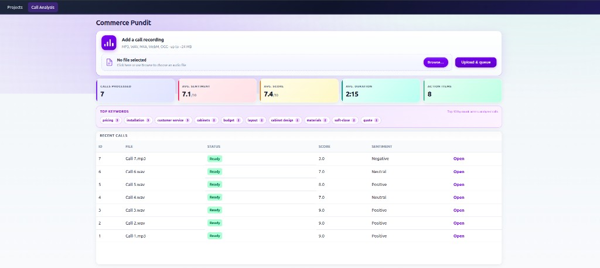
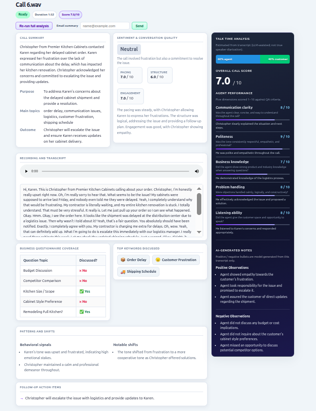

# Tanay1015 — Projects stack & Call Analysis

PHP / MariaDB / Redis monorepo with a **Call Analysis** app (upload audio → Whisper transcription → OpenAI analysis → dashboard). This README covers the **full Docker stack** and **step-by-step usage**.

---

## Prerequisites

- [Docker](https://docs.docker.com/get-docker/) and [Docker Compose](https://docs.docker.com/compose/) v2+
- An [OpenAI API key](https://platform.openai.com/api-keys) (for transcription + analysis)

---

## Quick start

1. **Clone / open the repo** (this folder should contain `docker-compose.yaml` and `Dockerfile`).

2. **Create a `.env` file** in the repo root (same directory as `docker-compose.yaml`):

   ```env
   OPENAI_API_KEY=sk-your-key-here
   ```

   Optional (email “Send summary” From address):

   ```env
   CALL_ANALYSIS_MAIL_FROM=noreply@yourdomain.com
   ```

3. **Start everything:**

   ```bash
   docker compose up -d --build
   ```

4. **Install Call Analysis DB tables** (safe to run more than once):

   ```bash
   docker compose exec fpm php /var/www/html/projects/CallAnalysis/db/install.php
   ```

5. **Open the app:**
   - **Projects hub:** [http://localhost](http://localhost)  
   - **Call Analysis dashboard:** [http://localhost/projects/CallAnalysis/](http://localhost/projects/CallAnalysis/)

---

## Docker stack (services)

| Service | Container name | Image / build | Host ports | Purpose |
|--------|----------------|---------------|------------|---------|
| **fpm** | `php-fpm` | `Dockerfile` (PHP 8.3 + FPM + Nginx via Supervisor) | **80** (HTTP), 9000 | Web app, PHP, Nginx; document root `/var/www/html` |
| **db** | `db` | `mariadb:10.6` | **3306** | MariaDB; database `vibecode`, user `root`, password `server` |
| **redis** | `redis` | `redis:7-alpine` | **6379** | Call Analysis job queue (worker `BRPOP`) |
| **callanalysis-worker** | `callanalysis-worker` | Same as `fpm` image | — | Runs `php …/projects/CallAnalysis/worker.php` continuously |
| **mailcatcher** | `mailcatcher` | `sj26/mailcatcher` | **1080** (UI), **1025** (SMTP) | Catches outbound mail from PHP (`msmtp` → Mailcatcher) |
| **adminer** | `adminer` | `adminer:latest` | **8080** | Web UI for MariaDB |

**Volume:** `./` is mounted to `/var/www/html` in `fpm` and `callanalysis-worker` (live code edits on the host).

**Environment (inherited from compose):**

- `DB_HOST=db`, `REDIS_HOST=redis`
- `OPENAI_API_KEY` from `.env`
- `SMTP_HOST=mailcatcher`, `SMTP_PORT=1025` on **fpm** (for other mail paths if used)

Database credentials used by `config/database.php` match `docker-compose` defaults unless you override `MYSQL_*` env vars.

---

## Common commands

```bash
# Start (foreground logs)
docker compose up --build

# Start detached
docker compose up -d --build

# Stop
docker compose down

# Logs — web / PHP
docker compose logs -f fpm

# Logs — Call Analysis worker (transcribe + analyze)
docker compose logs -f callanalysis-worker

# Re-run DB install
docker compose exec fpm php /var/www/html/projects/CallAnalysis/db/install.php
```

---

## Using Call Analysis (step by step)

### 1. Dashboard

Open **[/projects/CallAnalysis/](http://localhost/projects/CallAnalysis/)**.

- Upload an audio file (MP3, WAV, M4A, WebM, OGG; large uploads supported, see Nginx `client_max_body_size`).
- The call appears in **Recent calls** with status `pending` → `transcribing` → `analyzing` → `ready` (or `failed`).
- Metrics (calls, avg sentiment/score, keywords, etc.) refresh while you stay on the page.

### 2. Background processing

The **callanalysis-worker** service must be running. It:

1. Pops call IDs from Redis (`callanalysis:queue`).
2. Transcribes audio (OpenAI Whisper).
3. Runs analysis (OpenAI chat).
4. Writes results to MariaDB.

If calls stay stuck in `pending`, check:

```bash
docker compose ps
docker compose logs callanalysis-worker
```

Ensure `OPENAI_API_KEY` is set and the worker container was restarted after changing `.env`.

### 3. Call detail page

Open a call via **Open** or `/projects/CallAnalysis/call.php?id=<ID>`.

- Recording, transcript (click segment to seek), summary, questionnaire, keywords, action items, side panel (talk time, score, agent dimensions, AI notes).
- **Re-run full analysis** re-queues the call (same pipeline as a new upload).
- **Email summary** (when the call is `ready`): enter an address and **Send**. Email goes through PHP `mail()` → **msmtp** → **Mailcatcher** in dev (see below).

### 4. Email in development

Outbound mail from the app is routed to Mailcatcher:

- **Web UI:** [http://localhost:1080](http://localhost:1080)

`CALL_ANALYSIS_MAIL_FROM` (optional) overrides the default From address used by the summary email endpoint.

### 5. Database GUI (Adminer)

- [http://localhost:8080](http://localhost:8080)
- **System:** MySQL  
- **Server:** `db` (from host use `localhost` and port `3306` if you connect from your machine; from Adminer container, `db` is correct)  
- **Username:** `root`  
- **Password:** `server`  
- **Database:** `vibecode`

---

## App screenshots

### Dashboard



### Call detail



---

## Data dump note

I have added `vibecode.sql.gz` under the `db` folder with the result of all the recordings.

---

## Project layout (relevant paths)

```
.
├── docker-compose.yaml      # Stack definition
├── Dockerfile               # PHP-FPM + Nginx + extensions
├── config/database.php      # PDO from env (DB_HOST, MYSQL_*)
├── .env                     # OPENAI_API_KEY (create locally; gitignored)
├── index.php                # Projects hub (lists projects/)
└── projects/CallAnalysis/
    ├── index.php            # Dashboard
    ├── call.php             # Call detail
    ├── worker.php           # Queue worker (Redis)
    ├── reanalyze.php        # POST to re-queue a call
    ├── api/
    │   ├── upload.php       # Recording upload (JSON)
    │   ├── calls-status.php # Polling for row updates
    │   ├── dashboard-stats.php
    │   └── send-summary-email.php
    ├── db/install.php       # Schema installer
    ├── schema.sql           # ca_* tables
    ├── lib/                 # bootstrap, CallRepository, OpenAIClient, …
    └── storage/uploads/     # Stored recordings (created as needed)
```

---

## Troubleshooting

| Issue | What to check |
|--------|----------------|
| “Database tables are missing” on dashboard | Run `db/install.php` (CLI or browser `/projects/CallAnalysis/db/install.php`). |
| Calls never leave `pending` | Worker running? Redis up? `docker compose logs callanalysis-worker`. |
| Transcription / analysis errors | Valid `OPENAI_API_KEY`? Worker logs; `failed` status + error on call detail. |
| Upload fails / 413 | Nginx `client_max_body_size` (default 256M in app.conf). |
| Summary email “could not send” | `fpm` must reach SMTP; with compose, Mailcatcher on `mailcatcher:1025` via `msmtp` in the PHP image. Check `docker-config/php/php.ini` `sendmail_path`. |

---

## Development notes

- **HTTPS:** Compose exposes plain HTTP on port 80. For production, terminate TLS at a reverse proxy.
- **Secrets:** Never commit `.env`; rotate API keys if leaked.
- **Schema changes:** Edit `projects/CallAnalysis/schema.sql` and migration strategy as needed; `install.php` runs full `schema.sql` statements (idempotent patterns depend on SQL used).

---

## License / ownership

Use and deploy according to your organization’s policies for this repository.
